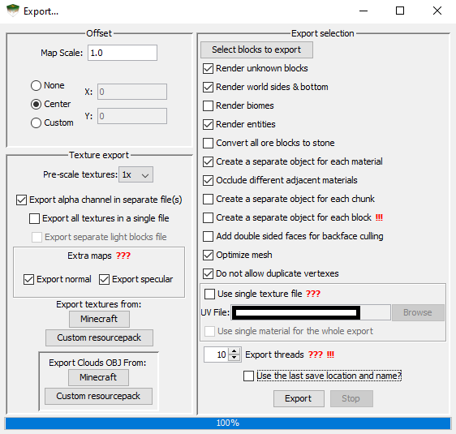

<!---
title: Creating an OBJ
path: /buildtheearth/rendering/blender
version: 1.0.0
authors:
    - @VapoR
--->

# Creating an OBJ

The first step of making a render is creating an OBJ file from your world or schematic. The OBJ file will later be imported into Blender. There are two software options for creating an OBJ, [Mineways](#using-mineways) and [jMc2Obj](#using-jmc2obj). Neither support Cubic Chunks worlds. If you have a Cubic Chunks world you'll need to make a schematic or convert to a vanilla world with the Cubic Chunks Converter.
```eval_rst
.. note::
   Mineways is much less optimized than jMc2Obj, so that is why I don't recommend Mineways for huge areas. With jMc2Obj you can render huge areas (I once did all of downtown Seattle and more) when optmize mesh is checked, however it has its drawbacks. When it is checked, panes, fences, walls, etc may be missing. If you uncheck optimize mesh, performance goes down drastically.
```
- Use [Mineways](#using-mineways) If These Apply
  * You have a schematic or vanilla world (jMc2Obj doesn't support schematics, but you could paste the schematic into a world)
  * You want a simple, small render (~ <500 x 500 blocks)
  * You don't care that banners and heads won't transfer properly, banners turn white and all heads turn into pumpkins

- Use [jMc2Obj](#using-jmc2obj) If These Apply
  * You have a vanilla world, or want to convert to one (1.13 - 1.18): You can use the [CubicChunksConverter](https://jenkins.daporkchop.net/job/OpenCubicChunks/job/CubicChunksConverter/job/master/) (-all.jar) to convert CubicChunks worlds into vanilla 1.12.2 worlds, then load the world in 1.17/18. More information in the [Cubic Chunks Discord](https://discord.gg/tJUWYq5wdR). Alternatively you can use schematics. Note that the CubicChunksConverter doesn't currently transfer heads and banners.
  * You want to render a large area (~ >500 x 500 blocks)
  * You want banners and custom heads to be in the OBJ. (Requires you to use a world with heads/banners, which you might not be able to do if you use the CubicChunksConverter)

```eval_rst
.. note::
   There's currently no good way of rendering things taller than 256 blocks if you created them on a 1.12.2 Cubic Chunks world. (If it was on a 1.17/1.18 vanilla server this note doesn't apply) You can either stack schematics in a 1.18 vanilla world then use that world to create a single OBJ, or make multiple schematics on the 1.12.2 world then create multiple OBJs.
```

## Using Mineways

1. Download Mineways [here](https://www.realtimerendering.com/erich/minecraft/public/mineways/downloads.html#downloadImgs). If you have an issue look at the info on the website
2. Open Mineways
3. On the top left click `File`, `Open`
4. Navigate to your schematic or vanilla world and double click the `.schematic` or `level.dat`
5. Use left click and drag to move around, scroll wheel to zoom
6. Use right click and drag to select a region to export
7. Note the `Height` and `Depth` sliders at the top of the screen. Only the blocks inside that range will be exported. Areas highlighted with purple inside the region will be exported
8. After selecting a region, click `File`, `Export for Rendering`
9. Select a folder to save the OBJ file, enter a name for the OBJ file, then click `Save`
10. A settings screen will pop up. Beginners just click `OK`
11. Wait until the blue progress bar at the bottom is complete, then exit the program. You should now have an OBJ (along with textures, etc) at the location specified in step 9
```eval_rst
.. note::
   If you run out of memory when exporting, click **Help**, and check **Give more export memory!**, then restart the program. If you ran out of memory it's likely a large area, in which case you should consider using jMc2Obj.
```

## Using jMc2Obj

1. Download newest jMc2Obj jar [here](https://github.com/jmc2obj/j-mc-2-obj/releases)
2. Execute the jMc2Obj jar file by either opening your terminal/command prompt, navigating to the same directory as the jar and typing `java -jar JMC2OBJJARNAME.jar` or on Windows right click the jar, `Open With`, `Java...`
3. Click the button with three dots `...` at the top left of the program and find your world (Must be a vanilla 1.13 - 1.18 world)
4. Click `Load`
5. Under `Preview Options` check `Fast Renderer` 
6. Use left click and drag to select a region to export, scroll wheel to zoom
7. Use right click to move around
8. After selecting a region, click `Export`
9. Copy these settings, adjusting thread count to your own computer's specs

10. Click `Export textures from: Minecraft`
11. Click `Export` on bottom right (use the same folder as the textures)

After the files are created, proceed [to the next step](importing-obj).