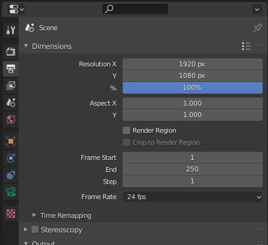
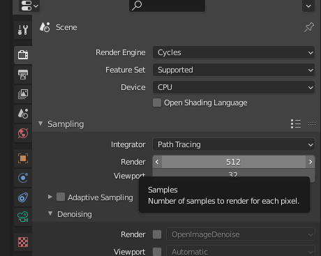

<!---
title: Exporting Render
path: /buildtheearth/rendering/blender
version: 1.0.0
authors:
    - @VapoR
--->

# Exporting Render

## Aspect Ratio / Resolution

Go to `Output Properties` on the right side panel and change `Resolution X` and `Resolution Y`.

## Denoising

Default settings in Blender using the cycles engine produces lots of noise/fireflies in the final image. Now there are a lot of ways to reduce noise without denoising explained [here](https://www.blenderguru.com/articles/7-ways-get-rid-fireflies), but here is a quick way to remove noise with good enough results.
1. Go to `Render Properties` on the right side panel, `Sampling`, `Denoising`, check `Render`, and switch from `NLM` to `OpenImageDenoise`. NVIDIA graphics cards are better for Blender, and have viewport denoising, but you can search that up yourself (it's very cool).
2. Celebrate

## Tile Size

Optimal tile size (the orange box that moves around when rendering the image) depends on whether you are CPU rendering or GPU rendering. For NVIDIA GPU rendering is much faster, instructions [here](https://artisticrender.com/how-to-use-the-gpu-to-render-with-blender/). For Raedon... GPU rendering doesn't work as well, but you can [try](https://artisticrender.com/how-to-use-the-gpu-to-render-with-blender/) using OpenCL. Now back to tile size, just enable the Auto Tile Size addon by going to `Edit`, `Preferences`, `Add-ons`, type `Auto Tile Size` in the search box, and check `Render: Auto Tile Size`.
## Samples

People always talk about sample count, but for basic renders just use 128 or 256 or 512, people can't tell the difference between that and 2048. In order to change the amount of samples go to `Render Properties` on the right side panel, `Sampling`, and change the `Render` value. You can also change the `Viewport` value, but don't make that high.

## Exporting / Rendering Image

1. Click F12 or on the top go to `Render`, `Render Image`
2. A window will pop up, and once it's done rendering, click `Image`, `Save as`

🥳🥳You're done!!!!!🥳🥳
Now go show it off!
And make sure to tell everyone about this awesome guide!